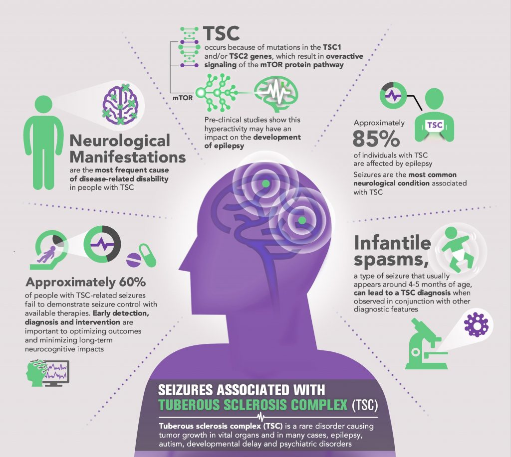

# TSC-mutilomics

This Project is a aim to use the multiomics data to analysis the TSC disease. We will use the scRNA data, scATAC data to analysis the TSC disease.



Source: https://www.childneurologyfoundation.org/disorders/tuberous-sclerosis-complex/


# File Structure

```bash
❯ tree -L 2
.
├── README.md
├── analysis
│   └── 01-QC
├── data
│   ├── processed-data
│   ├── raw-data
│   └── reference
├── images
│   └── TSC-intro.jpg
├── logs
├── reference
└── source
    ├── DEG_functions.R
    ├── mapping
    └── miRNA_gene_regulation_network.R

12 directories, 4 files
```